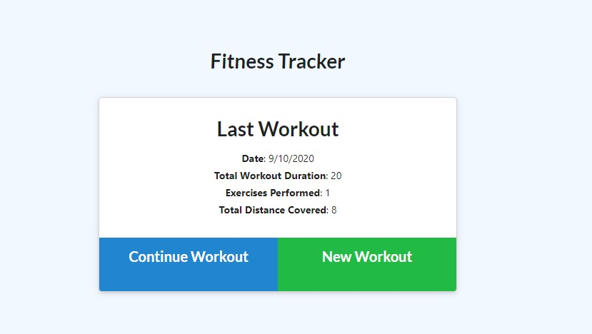
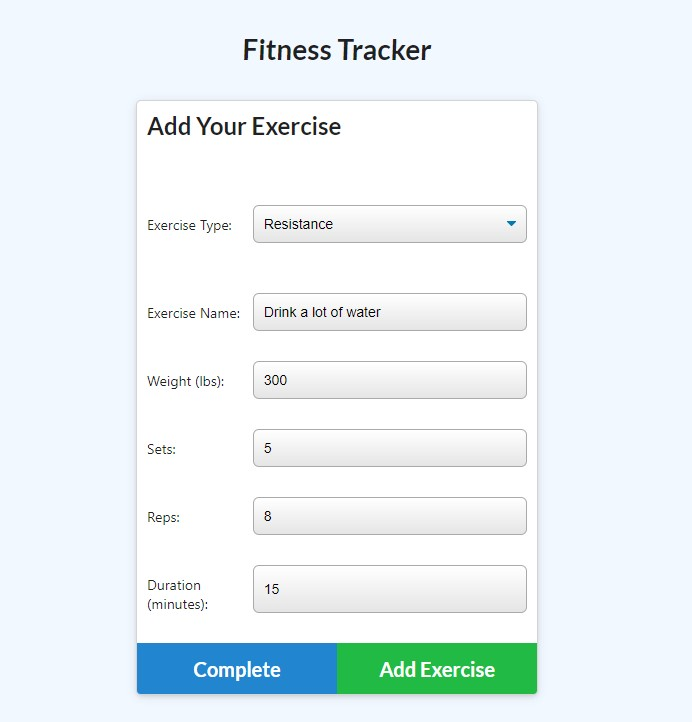
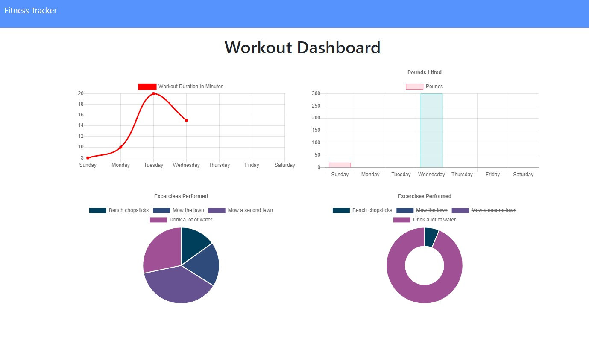

# workout-tracker

Homework17 - Makoto Asahi

Deployed Heroku Link:
https://sleepy-refuge-80959.herokuapp.com/

# Description

This app allows user's to add and track their workouts.

New users will first need to make a New Workout.

Once filled out, the workout and exercise will be added to the database to be tracked.

The app will tally and total the weight and duration of all workouts in the stats page.

# Installation

This app is deployed through heroku.

To run this app locally, download the repository and install the necessary npms with `npm i`.

Be sure to edit the db folder to link to the correct database after downloading.

`node server.js` will run this app.

# Usage

Track your workouts daily with this app.

Make workouts and track all your progress in the stats page.

